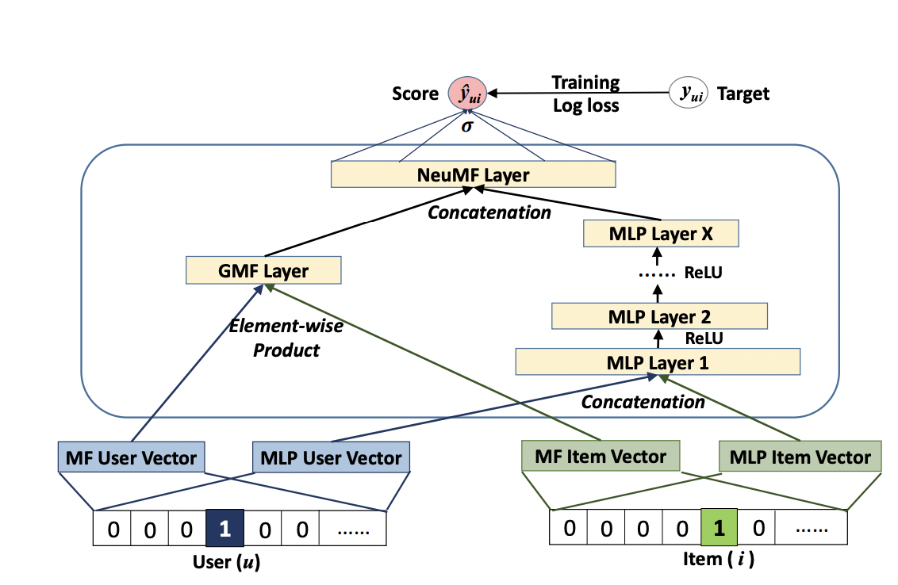
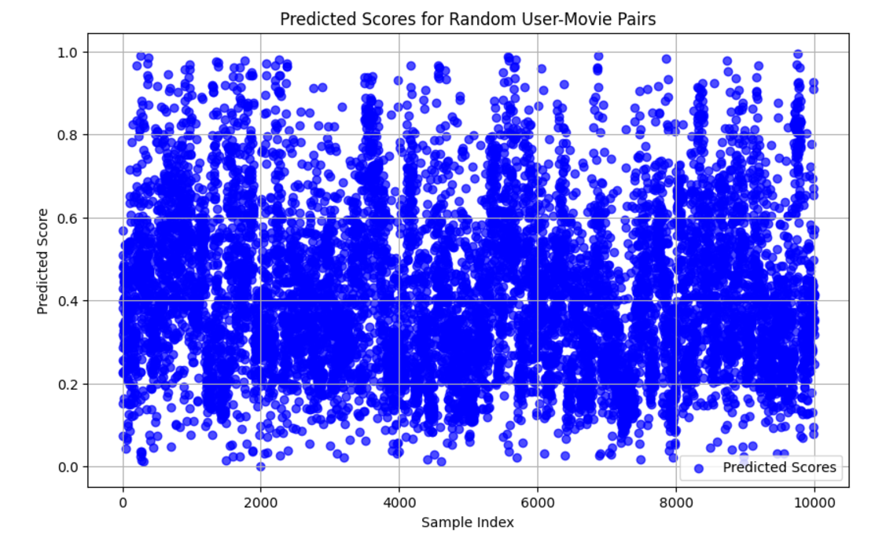

# NCF-Reimplementation
Reimplementing Neural Collaborative Filtering(NCF) Paper

[Medium Blog](https://p4rzvl.medium.com/neural-collaborative-filtering-a-neural-party-planner-for-personalized-recommendations-ef6242aa71d4)

[Kaggle Notebook](https://www.kaggle.com/code/parvakumar/ncf-ipynb)

[Kaggle Dataset](https://www.kaggle.com/datasets/justsahil/movielens-32m)

[Trained Model(.keras file)](https://www.kaggle.com/models/parvakumar/neural-collaborative-filtering/)

## Model Architecture

## Predictions Graph

